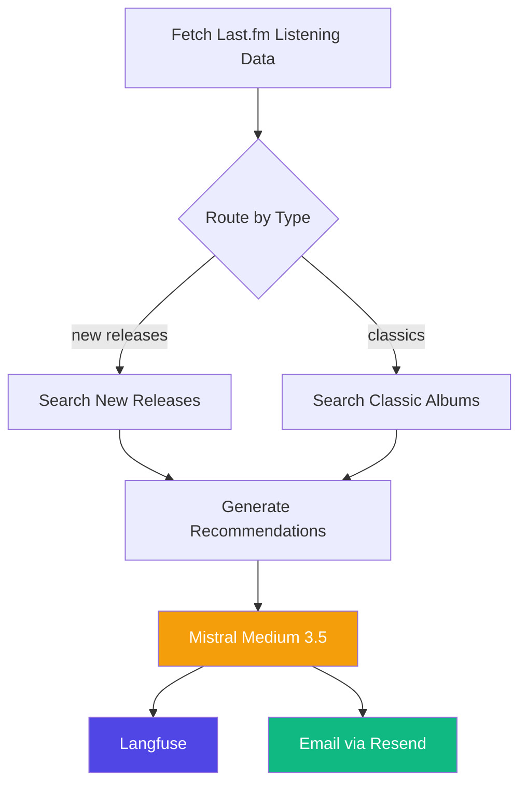

# tocadiscos

A LangGraph-powered agentic workflow that generates personalized music recommendations based on your Last.fm listening history, with Langfuse tracing and email notifications.

## Architecture


```mermaid
graph TD
    A[Fetch Last.fm Listening Data] --> B{Route by Type}
    B -->|new releases| C[Search New Releases]
    B -->|classics| D[Search Classic Albums]
    C --> E[Generate Recommendations]
    D --> E
    E --> F[Mistral Medium 3.5]
    F --> G[Langfuse]
    F --> H[Email via Resend]

    style F fill:#f59e0b,color:#fff
    style G fill:#5046e5,color:#fff
    style H fill:#10b981,color:#fff
```

## Quick Start

### 1. Clone and Install

```bash
cd tocadiscos
uv sync
```

The repository `uv.toml` keeps dependency installs seven days behind newly
published package versions.

### 2. Configure Environment

```bash
cp .env.example .env
# Edit .env with your API keys
```

### 3. Run

```bash
# Full workflow (new releases + classics)
uv run python main.py

# Only new releases
uv run python main.py --new-releases

# Only classics, no notifications
uv run python main.py --classics --no-notify

# Different user
uv run python main.py --user someone_else
```

## Project Structure

```
tocadiscos/
├── main.py                 # CLI entry point
├── pyproject.toml          # Project config & dependencies
├── uv.lock                 # Locked dependencies
├── uv.toml                 # uv resolver config with 7-day install delay
├── .env.example           # Environment template
└── src/
    ├── __init__.py
    ├── agent.py           # LangGraph workflow + Langfuse integration
    ├── lastfm_client.py   # Last.fm API wrapper
    ├── web_search.py      # Web search for album discovery
    └── notifications.py   # Email notifications (Resend)
```

## How It Works

### 1. Fetch Listening Data
The agent calls Last.fm API to get your last 30 days of scrobbles, then:
- Aggregates plays by artist
- Extracts top genres from artist tags
- Builds a "taste profile"

### 2. Search for Albums
Based on your taste profile:
- **New Releases**: Searches curated music publications for albums released in the last 15 days:
  - [Pitchfork](https://pitchfork.com) - Album reviews
  - [Stereogum](https://stereogum.com) - Album of the week
  - [Consequence of Sound](https://consequence.net) - New album streams
  - [Resident Advisor](https://residentadvisor.net) - Electronic/dance music
  - [The Line of Best Fit](https://thelineofbestfit.com) - Album reviews
  - [Jenesaispop](https://jenesaispop.com) - Spanish music
  - [Les Inrockuptibles](https://lesinrocks.com) - French music
  - [Nova](https://nova.fr) - French music
- **Classics**: Searches for "greatest albums" lists, excluding artists you already know

### 3. Generate Recommendations
Mistral Medium 3.5 analyzes by default:
- Your taste profile (artists, genres, listening patterns)
- Search results from the web
- Produces 5 personalized recommendations with explanations

Set `LLM_PROVIDER=anthropic` to use the Anthropic path instead.

### 4. Observe & Notify
- All steps are traced to Langfuse for debugging and analysis
- Results can be sent via email (Resend)

## License

MIT - do whatever you want with it!
